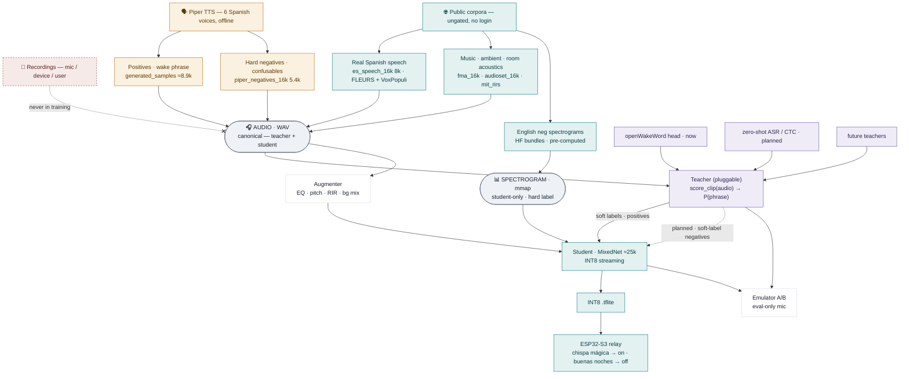

# Distillation strategy for wake word detection

Design doc: replacing/augmenting our current "train a tiny model from scratch on
synthetic data" approach with **knowledge distillation** from a large pretrained
speech-embedding model (the *teacher*) into a microcontroller-sized model (the
*student*), using our existing Piper-generated dataset.

**Status (2026-08-07): Path A A/B'd (mixed/marginal — §7); baseline shipped; next = Path B (§8).**
The openWakeWord-teacher distillation is fully implemented and runs; the automated A/B
(`train/tools/eval_ab.py`, two phrases) found it **helps one phrase and hurts the
other** — marginal and confounded by single-run variance; the large real-world gain came
from the **target-language speech negatives**, not the teacher. **Deployed: the baseline
(λ=0) students** to `firmware/models/turn_{on,off}.tflite`, `probability_cutoff` 0.80
(on-device tuning pending — eval cutoffs don't transfer, see §7 "Deployment state"). **No
code removed** — the distillation path stays dormant (`DISTILL=0`) as scaffolding for the
next step: **Path B (§8) — an ASR teacher that also soft-labels *negatives***, the one
lever with real headroom. Read §7 (verdict) and §8 (plan) first.

---

## 0. Big picture

The spine is **data provenance**: every training sample is either **synthesized**
(Piper TTS) or **downloaded** (public corpora). **Nothing is recorded.** The only
microphone in the system is the browser mic used for *evaluation*, and it never
touches the model.

> **Rule:** no mic, device, or user-recorded audio in training, ever. The
> synthetic-domain gap is closed with real *downloaded* speech, not captured
> speech. Browser-captured clips are eval-only.



The **dashed** teacher → student **negatives** edge is the one planned piece:
today the teacher only soft-labels augmented *positives* (negatives stay hard 0).
An ASR teacher scores *any* audio meaningfully, so it could soft-label the
negatives too — richer supervision, and a place where an ASR teacher naturally
beats the openWakeWord one (see §3.9 / Path B).

### Two forms of data

A training source arrives as one of two types, and the **type decides who can
consume it**:

| Form | What it is | Teacher | Student | Soft-labelable |
|------|-----------|:------:|:------:|:-----:|
| **Audio** (WAV) | positives, speech/music/ambient negatives, RIRs | ✅ | ✅ (augmenter derives spectrograms) | ✅ |
| **Spectrogram** (RaggedMmap) | pre-computed HF English negatives | ❌ | ✅ | ❌ (hard label only) |

The teacher runs its own mel front-end over the waveform, so it can only eat
audio. The student's input *is* the microfrontend spectrogram, so it eats either.
That's why **audio is the superset** and the pre-computed spectrograms are a
student-only accelerator (free open-set English diversity), not a requirement.

### The teacher is a pluggable slot

The entire teacher contract in the code is one method — `score_clip(audio_f32) ->
float` (P(phrase) in (0, 1]). Everything downstream (score alignment, the
soft-label blend, the loss) is teacher-agnostic, so different teachers are just
different classes with that method, and the A/B stays fair because only the
soft-label *source* changes.

| Teacher | Status | Note |
|---------|--------|------|
| openWakeWord head | **now** | trained head on a frozen speech-embedding backbone; needs speech negatives or it over-fires on any speech |
| zero-shot Spanish ASR / CTC | **planned** | forced-alignment P(phrase); rejects other speech intrinsically, no hard-neg mining |
| future teachers | open | any model with `score_clip` drops in behind the same rig |

### The student and the blend

MixedNet (≈25–30k params, full INT8, streaming/causal) trains on hard truth
blended with the teacher's soft label:

```
target = (1 − λ)·hard  +  λ·soft        # λ = 0.5
```

λ = 0 is byte-identical to plain training (BCE is affine in its target, so no
custom loss is needed).

### How a run executes

`DISTILL=1 ./run.sh` runs three phases per phrase — the baseline is kept as the
A/B control, only the distilled student is deployed:


The rest of this document is the detailed design and rationale behind that map.

---

## 1. Problem statement

Our Spanish models (trained by `train/train.py` + `run.sh` on ~6 Piper TTS
voices with heavy augmentation) are noticeably weaker in the room than
`okay_nabu`, which was trained by the ESPHome team on far larger and more
diverse data. The gap is a **data/domain gap, not a model-capacity gap**: the
student has to learn speaker-, accent-, mic- and room-invariance from a handful
of synthetic voices, while models like `okay_nabu` (or any large pretrained
speech encoder) learned those invariances from thousands of hours of real
speech.

Distillation attacks exactly this gap, because **distillation does not need
labels**: a teacher that already "understands speech" can supervise the student
on unlimited *real, unlabeled* audio (e.g. Common Voice Spanish), which our
current pipeline cannot use at all.

Prior art — this is a proven recipe:

- **[Lin et al. 2020, "Training Keyword Spotters with Limited and Synthesized
  Speech Data"](https://arxiv.org/abs/2002.01322)** — Google trained a speech
  embedding model on ~200M 2-second YouTube clips, then showed that a tiny
  *head* trained on purely synthetic keyword data on top of the frozen
  embeddings rivals models trained on thousands of real examples.
- **[openWakeWord](https://github.com/dscripka/openWakeWord)** — uses exactly that frozen Google
  [`speech_embedding`](https://tfhub.dev/google/speech_embedding/1) backbone + a small classification head trained on Piper-synthesized data. Famously
  robust with synthetic-only training — but the backbone is far too big for an
  ESP32-S3, which is why microWakeWord exists.

Our idea: keep openWakeWord's robustness, but *compress it* into something that
fits our firmware constraints.

---

## 2. Strategy alternatives

### Option 0 — baseline improvements (no distillation)

More Piper voices, more augmentation, real recordings via the PCMDUMP tooling,
tuned hyperparameters. Cheap, incremental, already partially done. Listed for
contrast: it does not change the fundamental limitation (the student never sees
real-speech supervision).

### Option A — representation distillation ("micro-embedder")

Train a small streaming trunk to **mimic the teacher's embeddings** directly:

```
audio ──► teacher (frozen, ~M params) ──► embedding e_t  ┐
                                                          ├─► loss: cosine/L2
audio ──► microfrontend ──► student trunk ──► proj ──► e_s ┘
```

1. Distill on a large *unlabeled* corpus (synthetic + Common Voice + our
   AudioSet/FMA audio). Loss: L2 or cosine distance between the teacher's
   frame embeddings and a linear projection of the student trunk output
   (a projection layer is needed because dimensions differ, e.g. 96-d teacher
   vs 64-ch student trunk).
2. Freeze the distilled trunk; train a tiny wake-word head (1–2 layers) on
   Piper positives + negative spectrograms — exactly the openWakeWord recipe,
   but on-device.

Note that in this option the teacher is **pure inference — no head, no
training at all**: the backbone's native output (96-d embedding vectors) *is*
the distillation target. The trained head exists only in Option B.

**Pros:** the trunk becomes a reusable asset — retraining for a *new phrase*
means retraining only the head (minutes, small data). Best long-term payoff.

**Cons:** biggest engineering effort; huge capacity gap (≈7M → ≈25k params)
means embeddings will be lossy and quality is an open experimental question;
and several teacher↔student **interface mismatches**, all on the input/
alignment side:

1. **Different front-ends.** The teacher computes its own mel-spectrogram
   from raw audio; the student eats 40-bin microfrontend features with the
   ESPHome uint16→int8 scaling (§4.1). Not reconciled — each side keeps its
   own front-end and only outputs are matched (standard cross-modal
   distillation). Harmless, but both representations of every clip must flow
   through the training pipeline.
2. **Frame-rate mismatch.** Teacher: one 96-d vector / 80 ms. Student trunk:
   one vector / 30 ms. 80 is not a multiple of 30, so frames must be aligned
   by pooling the student's vectors over each 80 ms window or interpolating
   the teacher's sequence onto the 30 ms grid — a real design choice that
   affects results.
3. **Causality.** The teacher's vector at time *t* is computed from audio
   *around* *t*, including some future; the student is strictly causal
   (streaming). Standard fix: the student at *t* predicts the teacher at
   *t − δ* (small lag).
4. **Dimensionality.** 96-d teacher vs 64-ch student trunk → small projection
   layer, used during distillation only and discarded at export.

None of these mismatches exist in Option B, where only one score per clip is
matched — a key reason B goes first.

### Option B — task distillation (teacher classifier → soft labels) — **recommended first step**

Use the big model only as a *teacher classifier* for our specific phrase:

1. Train an **openWakeWord-style teacher** for the phrase: frozen
   `speech_embedding` backbone + small head, trained on our existing Piper
   dataset. Cheap — minutes on CPU, openWakeWord's training notebook does
   most of it.
2. Train the **existing MixedNet student unchanged in architecture**, but with
   a distillation loss: `loss = α·BCE(hard label) + β·BCE(teacher score)`
   (soft labels), on:
   - our current positive/negative data (teacher scores computed on the
     *augmented waveforms* — see §5), and
   - optionally, raw real Spanish speech that the teacher pseudo-labels
     (soft negatives everywhere; near-misses become **mined hard negatives**).
3. Export exactly as today: same streaming INT8 TFLite, same manifest, same
   firmware.

**Pros:** smallest change to our pipeline (same architecture, same export,
same ESPHome integration); only one score per clip needed, which sidesteps
teacher/student time alignment entirely; the teacher doubles as a
hard-negative miner over hours of real audio.

**Cons:** teacher must be retrained per phrase (cheap, but the benefit doesn't
transfer to new phrases automatically); and — the key risk — **gains are
bounded by the teacher's own quality**. The teacher's head is trained on the
same small synthetic positive set as everything else, so the teacher itself
could turn out weak for our phrase. Two mitigations: (a) the head generalizes
far better than a from-scratch student on identical data, because the frozen
backbone contributes the real-speech knowledge (this is exactly the
[Lin et al. 2020](https://arxiv.org/abs/2002.01322) result, and the negative
side isn't small at all — openWakeWord ships ~2000 h of precomputed negative
embeddings); (b) the **B1 sanity gate** (§5): measure the teacher on the
real-audio eval set before distilling anything — if it doesn't clearly beat
the current student, stop and switch teachers (§3.8).

### Option C — run the embedding model on-device (rejected)

Run `speech_embedding` (or a Whisper-tiny-class encoder) directly on the
ESP32-S3 with a small head. Rejected: ≈7M+ parameters ≫ our ~25k budget;
INT8 still means multiple MB of weights and far too many MACs per 10 ms hop.
This is what a Raspberry-Pi-class satellite would do, not an S3.

### Option D — A after B (hybrid)

Do B now; if it shows a clear win, invest in A using the same infrastructure
(teacher inference over the augmented-waveform stream is shared code).

### Comparison

| Option                    | Effort     | Risk           | Pipeline change                     | New-phrase cost afterwards           | Expected gain          |
|---------------------------|------------|----------------|-------------------------------------|--------------------------------------|------------------------|
| 0 – more/better data      | low        | low            | none                                | unchanged (full retrain)             | incremental            |
| **B – task distillation** | **medium** | **low-medium** | **training loss + teacher scoring** | unchanged (full retrain, but better) | **likely significant** |
| A – micro-embedder        | high       | medium-high    | new training stage + head trainer   | **minutes (head only)**              | potentially large      |
| C – teacher on device     | —          | —              | —                                   | —                                    | infeasible on S3       |

---

## 3. Teacher candidates — comprehensive list

What makes a good teacher here: trained on **massive real speech**, encodes
**phonetic content** (not speaker identity, not audio events), reasonable to
run offline over hours of audio, license compatible (we redistribute nothing
from the teacher — only a student trained on its outputs — but Apache-2.0/MIT
teachers keep things simple).

> ⚠️ **"Voice embeddings" ambiguity.** *Speaker*-embedding models
> (ECAPA-TDNN, x-vector, GE2E/Resemblyzer, TitaNet) encode **who** is speaking
> and are trained to *discard* what was said — the exact opposite of what a
> wake-word teacher needs. They are listed in §3.7 only to document why they
> are excluded.

### 3.1 Google `speech_embedding` — ★ primary candidate

- **Architecture:** a stack of relatively simple convolutional blocks
  (no transformer) over mel-spectrogram input; ≈7M parameters. Output:
  one **96-dimensional embedding every 80 ms**.
- **Training:** supervised keyword-spotting objective on ≈**200M 2-second
  YouTube clips** (~100M containing target keywords from a 125-group keyword
  set, ~100M non-target). Published on
  [TF-Hub](https://tfhub.dev/google/speech_embedding/1), Apache-2.0;
  described in [Lin et al. 2020](https://arxiv.org/abs/2002.01322);
  code at [google-research/speech_embedding](https://github.com/google-research/google-research/tree/master/speech_embedding).
- **Why it's the top pick:** it is *task-matched* — trained specifically so
  that a tiny head can do keyword spotting on top of it, exactly our use.
  openWakeWord ships convenient `melspectrogram.tflite` +
  `embedding_model.tflite` re-implementations, plus a whole synthetic-data
  training pipeline we can reuse for the Option-B teacher head.
- **Caveats:** English-centric training data (works for Spanish in practice —
  openWakeWord community models exist in several languages — but a
  multilingual teacher below may score better on Spanish phonetics); frozen,
  somewhat dated (2020).

### 3.2 Self-supervised speech transformers (wav2vec 2.0 family)

Shared skeleton: a small **CNN waveform encoder** (7 conv layers, 16 kHz raw
audio → one frame / 20 ms) followed by a **Transformer** stack; trained
self-supervised on unlabeled speech; embeddings from middle layers carry
strong phonetic content.

| Model                                                        | Params           | Layers/dim           | Objective                            | Multilingual             | Notes                                                                         |
|--------------------------------------------------------------|------------------|----------------------|--------------------------------------|--------------------------|-------------------------------------------------------------------------------|
| [wav2vec 2.0](https://arxiv.org/abs/2006.11477) Base / Large | 95M / 317M       | 12×768 / 24×1024     | contrastive + quantized targets      | ✗ (LibriSpeech EN)       | the original                                                                  |
| [HuBERT](https://arxiv.org/abs/2106.07447) Base / Large / XL | 95M / 317M / ~1B | same skeleton        | masked prediction of clustered units | ✗                        | cleaner targets than w2v2                                                     |
| [WavLM](https://arxiv.org/abs/2110.13900) Base+ / Large      | 95M / 317M       | + gated rel-pos bias | HuBERT + denoising/overlap sim       | ✗                        | best on SUPERB; **denoising pretraining = robustness we want**                |
| [XLSR-53 / XLS-R](https://arxiv.org/abs/2111.09296)          | 317M / 300M–2B   | w2v2 Large skeleton  | contrastive                          | ✓ 53 / **128 languages** | **best Spanish phonetic coverage**                                            |
| [MMS](https://arxiv.org/abs/2305.13516)                      | 300M / 1B        | XLS-R skeleton       | contrastive                          | ✓ 1400+ languages        | Meta's massively-multilingual successor                                       |
| [DistilHuBERT](https://arxiv.org/abs/2110.01900)             | 23M              | 2 transformer layers | **distilled from HuBERT**            | ✗                        | proof that this family distills well; could even be an *intermediate* teacher |

Fit: excellent phonetic embeddings, and XLS-R/MMS give real Spanish coverage.
Cost: heavier offline inference than 3.1; frame embeddings every 20 ms
(alignment easier than 3.1's 80 ms, if we ever do Option A); layer selection
matters (phonetic info peaks in middle layers, not the top).

### 3.3 Whisper encoder

[Whisper](https://arxiv.org/abs/2212.04356) (OpenAI, MIT license): log-mel
input → 2 conv layers → Transformer encoder; trained *supervised* on 680k h
(v2) / 5M h (v3-turbo era) of multilingual ASR data — Spanish is one of its
strongest languages.

| Variant (total params, encoder ≈ half)                         | Encoder dims                               |
|----------------------------------------------------------------|--------------------------------------------|
| tiny 39M · base 74M · small 244M · medium 769M · large-v3 1.5B | 4×384 · 6×512 · 12×768 · 24×1024 · 32×1280 |

Fit: superb multilingual phonetics, easy to run (`whisper-tiny`/`base`
encoders are cheap). Caveats: processes fixed 30 s windows (padding needed for
short clips); embeddings are ASR-oriented rather than KWS-oriented — perfectly
usable for Option B scoring via a small trained head, slightly awkward for
Option A frame-level matching.

### 3.4 Conformer / fully-convolutional ASR encoders

- **Conformer** encoders ([Gulati et al. 2020](https://arxiv.org/abs/2005.08100),
  e.g. NVIDIA NeMo checkpoints, incl. Spanish): convolution + self-attention;
  strong ASR features, 10–120M params.
- **QuartzNet / Citrinet** (NeMo): **fully 1-D separable-convolutional**
  (6.7–19M params) — architecturally the closest big cousin of our MixedNet
  student, which can make feature distillation (Option A) better-behaved
  (similar receptive-field structure, no attention).

Fit: solid secondary candidates; NeMo Spanish checkpoints are a plus.

### 3.5 An openWakeWord *model* as teacher (for Option B)

Not a new network — 3.1 plus a phrase-specific head trained on our Piper data
via openWakeWord's training pipeline. This *is* the Option-B teacher. Listed
separately because it's the concrete artifact we'd actually run over hours of
audio to produce soft labels and mined hard negatives.

### 3.6 Unsuitable: audio-event / paralinguistic models

- **YAMNet / VGGish** (AudioSet event classifiers): embeddings organize by
  *sound category* (speech vs music vs dog), nearly phoneme-blind. ✗
- **TRILL / FRILL / TRILLsson** (Google, paralinguistic): optimized for
  emotion/speaker traits, deliberately weak on lexical content. ✗

### 3.7 Unsuitable: speaker-embedding models

**ECAPA-TDNN** (~6–15M, TDNN+attention), **x-vector**, **GE2E / Resemblyzer**
(LSTM), **TitaNet**: trained so that *the same words by different speakers map
far apart, and different words by the same speaker map together* — the inverse
of the invariance a wake-word model needs. ✗ (Interesting for a future
"respond only to me" feature, which is a different project.)

### 3.8 Shortlist

1. **`speech_embedding` via openWakeWord** — task-matched, tooling exists → use for Option B now.
2. **Whisper-base encoder** or **XLS-R 300M** — if Spanish phonetics prove to be the limiting factor.
3. **WavLM Base+** — if noise robustness proves to be the limiting factor.
4. **QuartzNet/Conformer (NeMo es)** — architectural-similarity candidate for Option A.
5. **ASR/CTC as a zero-shot teacher** — see §3.9; strong candidate to *replace* #1 if its calibration keeps hurting.

### 3.9 ASR / CTC model as a **zero-shot** teacher (a variant of Option B)

Idea: score each clip by *"does the audio say the phrase?"* using a pretrained
Spanish **ASR / CTC** model (e.g. `wav2vec2-large-xlsr-53-spanish`, Whisper),
and use that probability as the soft label. Two ways to get the number:
- **CTC forced-alignment** score of the target phoneme/grapheme sequence in the
  clip → P(phrase) ∈ [0,1] (the *soft, continuous* number — preferred), or
- **transcribe + phonetic fuzzy-match** the target phrase → a confidence. Here the
  match should be **phoneme-level, not orthographic**: classic **Soundex is
  English-surname-oriented and wrong for Spanish**; instead phonemize both the ASR
  transcript and the target to **IPA with espeak-ng** (already vendored — Piper uses
  it, and the trainer runs it in-browser) and score `1 − normalized_edit_distance`
  over the phoneme strings. Double Metaphone is a lighter middle ground. Note this
  path is discrete (it sits on top of the ASR's hard transcription decision) so it
  loses information vs. reading CTC posteriors directly — prefer forced-alignment
  when the soft label matters.

**Why it's attractive here.** It directly cures the failure we hit with the
openWakeWord teacher (§5 B-log): that teacher fires on *any* speech because its
negatives had no speech. An ASR teacher is **intrinsically discriminative** —
"buenas tardes" transcribes to *buenas tardes*, which doesn't match *chispa
mágica*, so it scores low **for free**, with no hard-negative mining. And ASR
models carry exactly the massive real-speech knowledge we want to distill.
Cost is irrelevant because scoring is **offline only** (feature-generation time),
never on-device.

**Bonus — cycle-consistency data filter.** Generate positives with Piper,
transcribe with the ASR, and **drop** any positive the ASR can't read back as the
phrase. Catches bad TTS voices (e.g. the mls_* ones) automatically, cleaning both
positives and, symmetrically, mislabeled negatives.

**How this differs from Options A and B** (this is the common point of confusion):

| | Teacher is… | Trained on our data? | Output used | Which option |
|---|---|---|---|---|
| **B (openWakeWord, current)** | frozen embedding + a **head we train** on Piper pos vs local neg | **yes** — quality bounded by *our* negative set | phrase probability → soft label | Option B |
| **B-ASR/CTC (this, §3.9)** | a **pretrained ASR**, used **zero-shot** | **no** — knowledge comes pre-baked from web-scale speech | phrase probability (via CTC/transcript) → soft label | **still Option B** |
| **A (micro-embedder)** | a pretrained speech **encoder** | no | its **hidden representation**, regressed into a reusable student trunk (phrase-agnostic) | Option A |

So **ASR/CTC is *not* Option A.** It sits squarely in **Option B** (task
distillation: teacher score → `α·BCE(hard) + β·BCE(teacher)` soft-label loss on
the *unchanged* MixedNet student). The only thing that changes vs. today's Option B
is the **teacher**: swap "a small classifier head we train on our limited data"
for "a big ASR we run zero-shot." Student, loss, and the B2/B3 integration are
identical — the scorer plugs into the same `generate_augmented_features()` hook.
The A vs B split is about **what you transfer** — a *representation* (A) vs. a
*task decision / label* (B) — not about which pretrained model you start from.

**Trade-offs.** Heavier scorer and CTC phrase-scoring needs care (alignment,
language/phoneme set, thresholding); but no teacher-training step and no
dependence on our negative set. Worth trying **before** investing more in the
openWakeWord teacher's calibration.

---

## 4. The student: our ESP32 net (MixedNet) — current state

Defined in `train/microwakeword/mixednet.py`, instantiated by
`train/train.py:561-568`. Based on
[MixConv: Mixed Depthwise Convolutional Kernels](https://arxiv.org/abs/1907.09595).

### 4.1 Input contract

- **Features:** 40-bin log-mel "microfrontend" spectrogram — 30 ms window,
  10 ms hop, 16 kHz mono. Computed *outside* the model: in training by the
  Python microfrontend, on-device by ESPHome's embedded C frontend.
- **Quantization of features:** firmware converts the frontend's uint16
  output as `int8 = round(u16 × 256 / 666) − 128` — the model's input
  quantization params are calibrated to match. Any new model **must keep this
  exact input contract** (40 features, this scaling) or the ESPHome
  `micro_wake_word` component breaks.
- ESPHome feeds the model 3 new spectrogram frames (30 ms) per invocation;
  the net's `stride=3` first conv matches this cadence: **one fresh output
  every 30 ms**.

### 4.2 Architecture (current production config)

```
input [T, 40]                                  (streamed 3 frames at a time)
 └─ expand → [T, 1, 40]
 └─ Conv2D 32 filters, kernel (5×1), stride 3, valid, no bias   + ReLU
 └─ Block 1: MixConv dw[5]        → 1×1 conv →  64ch, BN, ReLU
 └─ Block 2: MixConv dw[7 | 11]   → 1×1 conv →  64ch, BN, ReLU
 └─ Block 3: MixConv dw[9 | 15]   → 1×1 conv →  64ch, BN, ReLU
 └─ Block 4: MixConv dw[23]       → 1×1 conv →  64ch, BN, ReLU
 └─ (ring-buffer catch-up) → Flatten → Dense(1) → sigmoid
```

- **MixConv block** = channels split into groups, each group gets a different
  depthwise temporal kernel (e.g. half the channels see 7 frames of context,
  half see 11), then a 1×1 pointwise conv mixes channels. Cheap
  multi-time-scale context.
- No residual connections in our config (`--residual_connection 0,0,0,0`),
  one repeat per block.
- **Receptive field:** ≈154 input frames ≈ **1.5 s** (matches
  `clip_duration_ms: 1500`).
- **Size:** ≈25–30k weights → INT8 `.tflite` of a few tens of KB; small
  tensor arena.

### 4.3 Properties to preserve (the checklist)

Any architecture change must keep all of these:

| Property                                                                                                             | Why                                                                                                                                             |
|----------------------------------------------------------------------------------------------------------------------|-------------------------------------------------------------------------------------------------------------------------------------------------|
| **Streaming & causal** — every temporal op wrapped in `stream.Stream` ring buffers, valid padding, no future context | on-device inference processes 30 ms at a time with internal state (`stream_state_internal`); this is what makes 1.5 s of context affordable     |
| **Full INT8 quantization** (weights + activations), calibrated post-training                                         | ESP32-S3 vector-extension (esp-nn) INT8 kernels; FP is ~10× slower                                                                              |
| **Op set: Conv2D, DepthwiseConv2D, 1×1 conv, pooling, dense, sigmoid**                                               | these are the ops esp-nn accelerates and ESPHome's micro_wake_word tensor-arena build supports; exotic ops (attention, LSTM, layernorm) are out |
| **Input contract of §4.1** (40 feats, 10 ms hop, uint16→int8 scale, 3-frame stride)                                  | shared C frontend in firmware; manifest v2                                                                                                      |
| **Single sigmoid output** in [0,1]                                                                                   | ESPHome compares against `probability_cutoff` from the manifest JSON                                                                            |
| **Model ≲100 KB, arena ≲ tens of KB, inference ≪30 ms**                                                              | 8 MB PSRAM but tight SRAM; must keep up with the 30 ms cadence alongside the game firmware                                                      |
| **Trainable by our pipeline** (Keras → streaming conversion → INT8 TFLite)                                           | keeps `train.py` / web-trainer / run.sh working                                                                                               |

### 4.4 Do we need to change it?

- **Option B: no architecture change.** Same net, different loss. The only
  training-code change is adding the soft-label term (and plumbing teacher
  scores through the RaggedMmap feature store).
- **Option A: training-time change, same deployed trunk.** Add a projection
  head (1×1 conv / dense → 96-d) on top of the trunk for the distillation
  phase; discard it at export and attach the wake-word head. Deployed ops are
  unchanged.
- **If capacity is the bottleneck** (student can't absorb the teacher's
  knowledge): grow *within the same op set* — more pointwise filters
  (64→96/128), a 5th block, or enable residual connections (already supported
  by `mixednet.py`, helps deeper variants train). This scales cost linearly
  and stays esp-nn-friendly.
- **Alternative student families** (only if MixedNet plateaus): DS-CNN (ARM),
  TC-ResNet, MatchboxNet, [BC-ResNet](https://arxiv.org/abs/2106.04140)
  (Speech Commands SOTA at 10–300k params). All are conv-only and could be
  made streaming, but each needs its own streaming/quantization port —
  MixedNet already has that work done, so switching is a last resort.

---

## 5. Option B pipeline sketch

Four stages. B1–B3 are the minimal experiment; B4 is the second iteration.

```
B1  TEACHER        Piper WAVs ──► openWakeWord embeddings ──► train head
                                                  │
B2  SCORING        augmented WAVs ──► teacher ──► score per clip ──► *.npy
    (inside generate_augmented_features)          alongside RaggedMmap
                                                  │
B3  STUDENT        MixedNet trained with soft labels  ỹ = (1−λ)·y + λ·t
                                                  │
B4  MINING         teacher over real es audio ──► hard negatives ──► B2/B3 rerun
```

### B1 — build the teacher (openWakeWord head)

- Script: `train/train_teacher.py`, run in the **same `train/venv`** as
  `train.py`. (The original plan called for a separate venv to isolate
  openWakeWord's dep tree, but the implementation never installs the
  `openwakeword` package — it downloads the two backbone ONNX files directly
  and runs them with `onnxruntime`, which the `--distill` scoring path needs
  in the training venv anyway. `torch` is already a training dep; only `onnx`
  is genuinely new. If tensorflow/onnxruntime/onnx ever hit a protobuf pin
  conflict in one venv, split B1 back out — nothing else depends on the shared
  environment.)
- Backbone: the frozen Google `melspectrogram` + `embedding_model` ONNX files
  (Apache-2.0), auto-downloaded from openWakeWord's GitHub release. Run via
  `onnxruntime` (`teacher_infer.Teacher`), not the `openwakeword` package.
- Positives: embed our existing `generated_samples/*.wav` (all voices), clean
  plus a few augmented copies using the same vendored `Augmentation` as the
  student pipeline.
- Negatives: slice local `fma_16k`/`audioset_16k` audio into embedding windows.
  (openWakeWord also publishes precomputed negative embedding features for
  thousands of hours — a future upgrade if the local negatives prove too thin.)
- Head: small dense net on the flattened 16×96 embedding window, trained with
  torch and exported to `head.onnx`. Minutes on CPU.
- **Browser export:** the backbone already ships as ONNX (melspectrogram +
  embedding); export the trained head to ONNX as well. The full teacher is
  then three small ONNX files that run both in Python (scoring, B2) and in
  the browser via onnxruntime-web (emulator page, B5) — same runtime the
  trainer already uses for Piper TTS.
- **Sanity gate before continuing:** the teacher must clearly beat our current
  student on the real-audio eval set (§5 B5). If it doesn't, distilling it is
  pointless — stop and try a different teacher (Whisper/XLS-R, §3.8).

### B2 — teacher scoring during feature generation

The teacher consumes **raw 16 kHz waveforms**; our training set is stored as
precomputed spectrograms (RaggedMmap). Hook point:
`generate_augmented_features()` in `train/train.py`, which currently does

```
Clips ─► Augmentation.augment_generator ─► waveform ─► spectrogram ─► RaggedMmap
```

- Wrap the augmented-waveform generator: for each augmented clip, run the
  teacher (melspec + embedding + head, tflite on CPU, batched) on the **same
  3.2 s augmented waveform** the student will see as a spectrogram. The
  teacher therefore scores the *hard* version — with background noise, RIR,
  pitch shift — so its score doubles as a difficulty signal. Cross-modal
  (teacher: waveform, student: spectrogram) is standard.
- **Slide-frames detail:** `SpectrogramGeneration` with `slide_frames=10`
  yields 10 slid spectrograms per augmented clip. One teacher score per clip,
  replicated ×10, keeps score order aligned with `RaggedMmap` sample order.
- Storage: scores are one float per sample → a plain
  `<split>/teacher_scores.npy` next to each `wakeword_mmap` (no RaggedMmap
  needed). Written in the same generator pass, so order is aligned by
  construction.
- Teacher inference cost: ~3000 clips × ~2 augmented reps ≈ trivial (< minutes
  on CPU); scoring is not the bottleneck, augmentation already dominates.

### B3 — student training with soft labels

Key simplification: **BCE is affine in its target**, so
`α·BCE(y) + β·BCE(t)` is exactly one BCE against the blended target
`ỹ = (1−λ)·y + λ·t` (up to overall scale). No custom loss needed — the labels
just become floats.

Changes (all in vendored code, so no monkey-patching):

| File                                       | Change                                                                                                                                                                                                             |
|--------------------------------------------|--------------------------------------------------------------------------------------------------------------------------------------------------------------------------------------------------------------------|
| `train/train.py`                           | new flags `--distill --teacher_model <path> --distill_weight λ` (default λ=0.5); pass teacher through to feature generation; write `distill` section into `training_parameters.yaml`                               |
| `microwakeword/data.py` (`FeatureHandler`) | load `teacher_scores.npy` when present; `get_data()` returns soft targets alongside hard labels — sources without scores (HF negative spectrograms) get `soft = hard`                                              |
| `microwakeword/train.py`                   | `train_on_batch(x, ỹ, sample_weight=…)` uses the **blended** target as y; keep **hard** labels for the `class_weights` lookup (it indexes a dict by {0,1} — floats would break it) and for accuracy/recall metrics |

Optional, cheap win in the same pass: use the teacher score to **re-weight
positives** — a positive TTS clip the teacher scores near 0 is usually a bad
synthesis or destroyed by augmentation; down-weight it instead of forcing the
student to claim it's a perfect positive.

Export, quantization, manifest: **unchanged** (§4.3 contract untouched).

### B4 — hard-negative mining on real audio (iteration 2)

> **Status (2026-08-06): partially implemented as speech negatives (see CLAUDE.md
> "Speech negatives").** Real-speech negatives now feed both teacher and student:
> `train/tools/gen_piper_negatives.py` (Piper confusables) + `train/tools/fetch_speech.py`
> (real speech). **Corpus note:** the design below says "Common Voice es", but
> Common Voice and MLS are unusable on `datasets` 5.x (they ship loading scripts,
> which 5.x dropped) — the fetcher uses **FLEURS + VoxPopuli** (ungated,
> parquet-native) via a per-language `LANG_SOURCES` registry. Student negatives
> land via `train.py --student_neg_audio_dirs` as a `truth:False` mmap source.
> Still TODO from the original B4: *teacher-scored* soft negatives (score windows,
> keep near-misses with their teacher score instead of a flat hard 0) — needs an
> ASR-style teacher, since the openWakeWord head over-fires on speech (circular).

- Run the teacher over hours of real speech (FLEURS/VoxPopuli; our
  `audioset_16k`/`fma_16k` WAVs) with a sliding window.
- Windows scoring above a low bar (e.g. 0.2) are **near-misses** → save as
  WAV clips → new negative clip source: spectrograms via the existing
  `SpectrogramGeneration` (no augmentation needed), `truth: False`, teacher
  scores attached (these are *soft* negatives — the teacher's 0.35 is more
  informative than a flat 0).
- Add as another `features:` entry in the training config with its own
  sampling/penalty weight.

### B5 — evaluation via the web trainer (build FIRST, before B1)

> **Status (2026-08-06): B5a + B5b BUILT** in `docs/emulator/index.html`, backed
> by a reusable teacher runtime in `docs/common/teacher.js` (a faithful browser
> port of `train/teacher_infer.py` via onnxruntime-web — mel→embed→head, same
> scaling/windowing; window math checked against the Python reference). Not yet
> exercised end-to-end against a real teacher/mic. Still TODO: batch-scoring the
> banked clips in one pass, porting the same logic into the trainer's Test tab,
> and the actual λ=0-vs-λ=0.5 A/B run.

Augmented test splits won't show the real gain — the whole point is
generalization *beyond* the synthetic domain, so evaluation needs **real
voices**. Decision (2026-08-06, "just Piper"): **no device-captured (PCMDUMP)
and no user-recorded audio in training, ever** — training data is exclusively
synthetic (Piper TTS) + downloaded public corpora (HF negatives, AudioSet,
FMA, Common Voice for B4 mining). Real-voice evaluation happens **in the
browser**, integrated directly into the existing **emulator page**
(`docs/emulator/index.html`) rather than a separate tab — teacher and student
are both light enough to run **simultaneously on the same mic stream**. The
same logic lands in the trainer's copy of the emulator/test code.

Two parts:

- **B5a — eval-set capture (no model needed). [BUILT]** A clip bank on the
  emulator's Live-mic tab: **⧉ Capture last 2 s** plus **auto-capture on
  detection**, backed by a rolling 4 s ring buffer of the mic stream. Each
  clip is stored in IndexedDB (`clips` store) with a ✓/✗ label
  (positive / negative) and the models' scores, and offers per-clip
  play / re-score / delete and a **⭳ Download all** (one labelled WAV each,
  filename encodes label + timestamp + student/teacher peaks). Eval-only;
  captured audio never enters training. Mic still requires HTTPS or localhost
  (`ssh -L` tunnel when browsing from another machine).
- **B5b — dual live scoring in the emulator (needs B1). [BUILT]** A left-column
  "Teacher (A/B)" loader takes the three teacher ONNX files (cached in
  IndexedDB), and the Live-mic tab plots **student + teacher scores side by
  side** off the **same 16 kHz mic stream** (student: microfrontend → WASM
  inference as today; teacher: `docs/common/teacher.js` melspectrogram →
  embedding → head via onnxruntime-web, scored on a rolling 2 s window every
  150 ms). Per-clip **↻ re-score** runs both loaded models over a banked clip;
  a one-pass batch re-score of the whole bank is still TODO.
- Metric: recall on real positives at a fixed false-accepts rate measured on
  the banked ambient audio (mirrors microwakeword's `average_viable_recall`
  but on real recordings).
- A/B rule: baseline vs distilled student trained with **identical data,
  steps, and seeds** — the only difference being the loss (λ=0 vs λ=0.5).
- Known limitation, accepted: the browser mic path (laptop/phone mic, other
  room position) is not the device path (ES8311/INMP441 + fixed position).
  Relative comparisons — teacher vs student, λ=0 vs λ=0.5 — remain valid;
  absolute on-device rates will differ. Captured clips are **eval-only** and
  never enter training.

### Order of work

1. ~~**B5a first** (capture UI + eval set)~~ — **DONE** (clip bank in the emulator)
2. ~~B1 teacher (train + ONNX export)~~ **DONE** → ~~**B5b dual scoring in the
   emulator**~~ **DONE** → sanity gate on the B5a eval set ← **next: run this**
3. ~~B2 + B3 minimal run (existing data only, λ=0.5) vs λ=0 baseline~~ — code
   + `DISTILL=1 run.sh` DONE; **A/B DONE (2026-08-07, 2 phrases) → mixed/marginal,
   see §7** (helped buenas_noches, hurt chispa_magica).
4. ~~If win → B4 mining; sweep λ; teacher temperature~~ — **not pursued** (gain too
   small/inconsistent to justify openWakeWord-teacher tuning)
5. ~~If big win → revisit Option A~~ — **not pursued.** The remaining lever with
   headroom is **Path B** (§3.9 ASR teacher, also soft-labeling negatives), not more
   openWakeWord-teacher tuning.

## 6. Recommendation

Start with **Option B** using the **openWakeWord (`speech_embedding`) teacher**:
lowest risk, no firmware or architecture change, and it directly tests the
core hypothesis — that real-speech knowledge from a pretrained teacher fixes
the synthetic-data weakness. Instrument first with the browser-captured eval
set and dual teacher/student scoring in the emulator (§5 B5) — no
device-captured or user-recorded audio in training, anywhere.
If B wins, promote to **Option D** (build the reusable micro-embedder,
Option A), which would make every future phrase a minutes-long head-training
job instead of a 30k-step GPU run.

## 7. Findings — Path-A verdict (2026-08-07): small, inconsistent, phrase-dependent

Path A (openWakeWord `speech_embedding` teacher → soft **positive** labels) was run
end-to-end and A/B'd against the plain student with `train/tools/eval_ab.py` on **two
phrases**. **The result is mixed: distillation helped one phrase and hurt the other,
with no consistent direction — a marginal effect, confounded by single-run training
variance. It is not a clear win, and not worth adopting wholesale over the simpler
baseline.**

### Setup
- Models per phrase: `<phrase>_sa/model_baseline` (λ=0) vs `model_distill` (λ=0.5),
  both production-trained (SAMPLES=5000, STEPS=45000, NEG_CLASS_WEIGHT=22) with the
  target-language speech negatives already in both. **One training run each — no seed
  replication**, so within-phrase deltas below carry run-to-run noise.
- Clips (Piper + real speech; faithful streaming via `inference.Model`, state reset
  per clip, step_ms=10, 500 ms PCAN warm-up): 270 full-phrase positives, ~810–990
  partials/confusables, 5×27 gapped positives, **8000 real Spanish-speech negatives**
  (FLEURS + VoxPopuli). Partials are phrase-tailored, so partial-FA is comparable
  **within** a phrase (baseline vs distill), not across phrases.

### Result — at the deployment cutoff 0.90 (fair within-phrase: same clips)
| phrase | model | pos recall | partial FA | FA/hour (real es speech) |
|--------|----------|-----------|-----------|--------------------------|
| chispa_magica | baseline | 78.1% | 10.3% | **0.59** |
| chispa_magica | distill  | 78.5% |  8.9% | **3.21** |
| buenas_noches | baseline | 74.8% |  6.7% | **0.86** |
| buenas_noches | distill  | 76.7% |  2.7% | **0.78** |

Peak-score margin (mean `pos_peak − partial_peak`, discrimination sharpness):
- chispa: baseline **+0.656**, distill **+0.657** — identical (no gain).
- buenas: baseline **+0.615**, distill **+0.698** — distill sharper.

Matched-recall FA/hour (from `results.json`, usable low-FA regime, recall ≤~76%):
- chispa: baseline ≈**0.27**/h vs distill ≈**0.90**/h → **baseline ~3× better**.
- buenas: distill reaches ~76% recall at ≈**0.20**/h while baseline needs ~3/h →
  **distill much better**.

### Interpretation
1. **Opposite verdicts across the two phrases.** For **chispa_magica**, distillation is
   *worse*: ~5× the open-set false accepts at matched recall, no margin gain. For
   **buenas_noches**, distillation *dominates baseline* at the deploy cutoff — higher
   recall, better partial rejection (2.7% vs 6.7%), lower open-set FA, and a genuinely
   larger margin. Same pipeline, same λ, same negatives — only the phrase differs.
2. **So the effect is real but small and inconsistent.** This matches the on-device
   hand-testing ("baseline ≈ distill"): the teacher soft-labels only *positives*, which
   are already near 1, so any effect is second-order and easily swamped by which phrase
   / which single training seed you happened to draw.
3. **The dominant lever remains the negatives, not the teacher.** Both baselines are
   already strong because of the target-language speech negatives (§B4 / CLAUDE.md
   "Speech negatives"); distillation moves things by a phrase-dependent ±.
4. **Gapped phrase is an architecture limit, not a distillation lever.** Recall falls
   off with inter-word gap for *both* models (`eval_ab.py` gap-sweep) — the fixed
   streaming receptive field, unrelated to distillation.

### Decision
- **Default to baseline for production** (`DISTILL=0`, the default): it's simpler, adds
  no teacher-training phase, and it was the safer choice on the phrase where they
  diverged most (chispa). **Exception, data-driven:** for a specific phrase where the
  A/B shows distill clearly dominating (as buenas_noches did here), shipping that
  phrase's `model_distill` is defensible — decide **per phrase from its own A/B**, not
  globally.
- **Do NOT invest further in openWakeWord-teacher tuning** on this evidence. The gain is
  too small and noisy; separating signal from single-run variance would need multi-seed
  runs, which isn't worth it versus the alternative below.
- **Keep the soft-label plumbing** (the `clip_scorer` hook, `data.py` soft targets, the
  `train.py` blend; λ=0 is byte-identical to baseline). It is teacher-agnostic
  scaffolding for the higher-value **Path B — an ASR teacher that also soft-labels
  *negatives*** (§3.9), which targets the one consistent failure mode across both
  phrases (open-set false accepts on real speech) instead of the already-saturated
  positives.

> **Caveat on absolute numbers.** Positives are isolated Piper clips (PCAN warm-up
> understates recall — see the isolated-clip note); trust the *within-phrase, model-vs-
> model* deltas and the FA/hour (measured on 8000 real clips), not the absolute recall.

### Deployment state (2026-08-07)
- **Shipped: the baseline (λ=0) students.** `firmware/models/turn_on.tflite` ←
  `chispa_magica_sa/model_baseline`, `turn_off.tflite` ← `buenas_noches_sa/model_baseline`.
  (buenas distill was marginally better in the A/B, but the gain is too small/inconsistent
  to justify carrying the teacher; baseline is the simpler, safer default.)
- **`probability_cutoff` set to 0.80** in both manifests (up from 0.76), as a *safe*
  first step for on-device FP-reduction. **The eval_ab cutoffs do NOT transfer to
  firmware**: (a) ESPHome fires on the average of `sliding_window_size` (=5) model
  outputs, which is lower than a single-frame peak; (b) eval positives are PCAN-
  understated. So tune on-device: raise in ~0.02–0.03 steps until random fires stop,
  back off if it starts missing (repeating the phrase once is the accepted trade). Only
  on-device is authoritative for the absolute cutoff; eval_ab is for model-vs-model and
  direction, not the number.
- **No code was removed** (decision 2026-08-07): the whole distillation path stays in
  place, dormant (`DISTILL=0` default; λ=0 ≡ baseline). It is the scaffolding for §8.

## 8. Next step — Path B: ASR teacher that soft-labels **negatives**

Path A's ceiling was structural: the openWakeWord teacher only soft-labels *positives*
(already ≈1, no headroom) and it over-fires on speech, so it can't label negatives
without circularity. **Path B fixes both** by swapping the teacher for a **pretrained
Spanish ASR/CTC model used zero-shot** (still Option B — same MixedNet student, same
B2/B3 hook, same blend; only the teacher changes; see §3.9). Because an ASR teacher
scores *any* audio meaningfully (≈0 on non-phrase speech), it can label the **negatives**
too — which is the one failure mode that was consistent across both phrases (open-set
false accepts on real speech).

**Reuses, unchanged (the dormant scaffolding):** `audio/spectrograms.py` `clip_scorer`
hook, `microwakeword/data.py` soft-target loading of `teacher_scores.npy`,
`microwakeword/train.py` `(1−λ)·hard+λ·soft` blend, the `--distill_weight` flag, and
`train/tools/eval_ab.py` as the A/B harness. The teacher contract is one method,
`score_clip(audio_f32)->float` — everything downstream is teacher-agnostic.

**To build:**
1. **`train/teacher_asr.py::AsrTeacher`** — `jonatasgrosman/wav2vec2-large-xlsr-53-spanish`
   (HF `transformers`; new dep — `torch`/`torchaudio` already present; offline, size
   irrelevant). `score_clip` via **forced alignment** (primary): slide a ~1.6 s window
   (win 25600, hop 8000); per window `exp(−F.ctc_loss(logprobs, target_ids,
   blank=pad_id)/len)` = P(phrase)∈(0,1]; take **max over windows** (mirrors the owww
   teacher's max-over-windows so the two are comparable). Also a `fuzzy` mode behind
   `--asr_score_mode {align,fuzzy}` (transcribe → `1 − norm_levenshtein(ipa(text),
   ipa(target))`, espeak-ng IPA, **not** Soundex) as a cheap sanity baseline; default
   `align`.
2. **`train.py`** — replace the hardcoded owww `Teacher` import with a factory on new
   flag `--teacher_type {owww,asr}` (default `owww` = Path A unchanged) + `--asr_model
   --asr_score_mode`. **Extend the scoring hook to negatives:** route the raw negative
   audio (`piper_negatives_16k`, `<lang>_speech_16k`) through the same `score_clip` and
   write `teacher_scores.npy` beside the negative mmaps too (positives-only today). This
   is where Path B beats Path A.
3. **`run.sh`** — new `TEACHER_TYPE` env; write the ASR student to `model_distill_asr/`
   alongside `model_baseline/` (and `model_distill/` owww) so all three coexist for a
   clean three-way A/B (baseline vs distill-owww vs distill-asr).
4. **Go/no-go gate before a full run:** score ~10 known positives + ~10 Spanish
   negatives offline; confirm pos ≫ neg. Then `eval_ab.py` A/B (expect distill-asr to
   cut open-set FA/hour at matched recall — the metric Path A couldn't move).

**Not in scope / rejected:** more owww-teacher tuning (§7); Option A (§2). The emulator
teacher panel stays owww-only (ASR is too big for the browser) — the real verdict is the
three students in `eval_ab.py` on real speech.